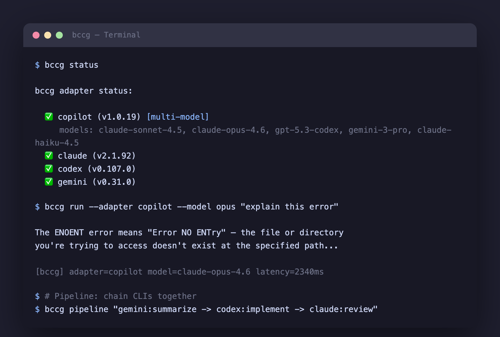

# beautiful-ccg (bccg)

[](https://github.com/justn-hyeok/beautiful-ccg/actions/workflows/ci.yml)
[](https://www.npmjs.com/package/@beautiful-ccg/cli)
[](./LICENSE)

[English](./README.md) | **한국어**

Claude, ChatGPT, Gemini를 함께 쓰세요 — 이미 설치된 CLI 그대로.

bccg는 여러 AI CLI(Claude Code, GitHub Copilot, OpenAI Codex, Google Gemini)를 하나로 묶는 MCP 서버 + CLI 도구입니다. 프롬프트를 최적의 CLI로 자동 라우팅하거나, 여러 CLI를 파이프라인으로 체이닝하거나, MCP 도구로 노출해서 어떤 호스트에서든 사용할 수 있습니다.

<p align="center">
  
</p>

## 주요 기능

- **자동 라우팅** — `cheap-first`, `quality-first`, `balanced` 전략으로 프롬프트에 맞는 CLI 자동 선택
- **병렬 실행** — `parallel` 전략으로 모든 어댑터를 동시 실행하고 결과를 합산
- **Copilot 멀티모델** — 단일 Copilot CLI로 18개 모델(Claude, GPT, Gemini, Grok) 접근
- **파이프라인 DSL** — CLI 체이닝: `gemini:summarize -> codex:implement -> claude:review`
- **MCP 서버** — 모든 기능을 MCP 도구로 노출 (`bccg_run`, `bccg_pipeline`, `bccg_status`)
- **설정 기반 라우팅** — `.ccg/config.yaml`로 커스텀 라우팅 규칙 및 어댑터 설정
- **재귀 방지** — `BCCG_DEPTH` 환경변수로 호스트 CLI가 자기 자신을 호출하는 무한 루프 차단
- **제로 설정** — `bccg init`으로 설치된 CLI 자동 감지, 설정 생성, MCP 등록까지 한 번에

## 요구사항

- Node.js >= 20
- 아래 AI CLI 중 하나 이상 설치:
  - [GitHub Copilot CLI](https://docs.github.com/en/copilot/github-copilot-in-the-cli) (`copilot`)
  - [Claude Code](https://docs.anthropic.com/en/docs/claude-code) (`claude`)
  - [OpenAI Codex](https://github.com/openai/codex) (`codex`)
  - [Google Gemini CLI](https://github.com/google-gemini/gemini-cli) (`gemini`)

## 설치

```bash
# npm
npm install -g @beautiful-ccg/cli

# 또는 소스에서 빌드
git clone https://github.com/justn-hyeok/beautiful-ccg.git
cd beautiful-ccg
pnpm install && pnpm build
cd packages/cli && pnpm link --global
```

## 빠른 시작

```bash
# 1. 설치된 CLI 감지 및 MCP 설정
bccg init

# 2. 사용 가능한 CLI 확인
bccg status

# 3. 프롬프트 실행 (자동 라우팅)
bccg run "이 에러 설명해줘: ENOENT"

# 4. 특정 CLI 지정
bccg run --adapter claude "이 코드 리뷰해줘"

# 5. Copilot 멀티모델 라우팅
bccg run --adapter copilot --model opus "복잡도 분석해줘"

# 6. 파이프라인으로 CLI 체이닝
bccg pipeline "gemini:summarize -> claude:review" -p "MCP 프로토콜 설명"

# 7. 모든 CLI 병렬 실행
bccg run --strategy parallel "재귀를 한 문장으로 설명해"
```

## CLI 레퍼런스

### `bccg run [prompt]`

AI CLI로 프롬프트를 실행합니다.

| 옵션 | 설명 | 기본값 |
|---|---|---|
| `-s, --strategy <이름>` | 라우팅 전략 | `balanced` |
| `-a, --adapter <이름>` | 특정 어댑터 지정 (`copilot`, `claude`, `codex`, `gemini`) | 자동 |
| `-m, --model <모델>` | 모델 지정 (예: `opus`, `sonnet`, `grok`) | 어댑터 기본값 |
| `-t, --timeout <ms>` | 타임아웃 (밀리초) | 어댑터별 기본값 |
| `--json` | JSON으로 출력 | |
| `--verbose` | 라우팅 결정 과정 출력 | |

stdin 지원: `echo "프롬프트" | bccg run -`

**전략:**

| 전략 | 동작 |
|---|---|
| `cheap-first` | 가장 저렴한 CLI로 라우팅 |
| `quality-first` | 가장 비싼 (최고 품질) CLI로 라우팅 |
| `balanced` | 프롬프트를 분류하고, 작업 유형에 맞는 최적 티어 선택 |
| `parallel` | 모든 CLI를 동시 실행하고 결과 합산 |

결과는 stdout, 메타데이터는 stderr로 출력됩니다.

### `bccg pipeline <steps>`

멀티스텝 CCG 파이프라인을 실행합니다.

```bash
bccg pipeline "gemini:summarize -> codex:implement -> claude:review" -p "재시도 로직 추가"
```

| 옵션 | 설명 |
|---|---|
| `-p, --prompt <프롬프트>` | 파이프라인 기본 프롬프트 |
| `-t, --timeout <ms>` | 타임아웃 (밀리초) |
| `--json` | JSON으로 출력 |

### `bccg status`

설치된 CLI, 버전, 지원 모델을 표시합니다.

```
$ bccg status
  ✅ copilot (v1.0.19) [multi-model]
     models: claude-sonnet-4.5, claude-opus-4.6, gpt-5.3-codex, gemini-3.1-pro, ...
  ✅ claude (v2.1.92)
  ✅ codex (v0.107.0)
  ✅ gemini (v0.31.0)
```

### `bccg doctor`

bccg 상태를 종합 진단합니다: 어댑터, 설정, MCP 등록 여부.

```
$ bccg doctor
📋 Config
  ✅ .ccg/config.yaml
📄 .mcp.json
  ✅ .mcp.json
🔌 Adapters
  ✅ copilot (1.0.19) [multi-model]
  ✅ claude (2.1.92)
🔗 MCP Registration
  ✅ claude → ~/.claude.json
⚠️  2개 이슈 발견. 'bccg init'으로 대부분 해결할 수 있습니다.
```

### `bccg init`

CLI를 자동 감지하고 bccg를 설정합니다.

1. `copilot`, `claude`, `codex`, `gemini` 스캔
2. `.ccg/config.yaml` 생성
3. `.mcp.json` 프로젝트 로컬 MCP 설정 생성
4. 각 CLI의 글로벌 설정에 bccg MCP 서버 등록

### `bccg serve`

MCP 서버를 시작합니다 (stdio 트랜스포트). 보통 호스트 CLI가 자동으로 호출합니다.

## MCP 도구

MCP 서버로 실행될 때 3개의 도구를 노출합니다:

### `bccg_run`

자동 라우팅 또는 특정 어댑터로 프롬프트를 실행합니다.

```json
{
  "prompt": "이 함수 설명해줘",
  "strategy": "balanced",
  "adapter": "copilot",
  "model": "opus"
}
```

### `bccg_pipeline`

DSL을 사용해 멀티스텝 파이프라인을 실행합니다.

```json
{
  "steps": "gemini:summarize -> codex:implement -> claude:review",
  "prompt": "인증 모듈에 에러 핸들링 추가"
}
```

### `bccg_status`

사용 가능한 어댑터와 상태를 확인합니다. 파라미터 없음.

## 파이프라인 DSL

`->` (또는 `→`)로 여러 CLI를 체이닝합니다:

```
adapter:action -> adapter:action -> adapter:action
```

각 스텝은 순차 실행됩니다. 이전 스텝의 출력이 다음 스텝의 컨텍스트로 전달됩니다. 마지막 스텝에는 종합 프롬프트가 추가됩니다.

**예시:**

```bash
# Gemini로 요약, Claude로 리뷰
bccg pipeline "gemini:summarize -> claude:review" -p "MCP 설명"

# Copilot 특정 모델로 분석, Codex로 구현
bccg pipeline "copilot:opus:analyze -> codex:implement" -p "캐싱 추가"

# 3단계 파이프라인
bccg pipeline "gemini:summarize -> codex:refactor -> claude:judge" -p "인증 최적화"
```

**형식:**
- `adapter:action` — 지정된 어댑터에서 action을 프롬프트 프리픽스로 실행
- `adapter:model:action` — 모델 지정 (Copilot 같은 멀티모델 어댑터용)
- `action` — 스텝을 자동 라우팅

최대 10스텝.

## 설정

`bccg init`이 `.ccg/config.yaml`을 생성합니다:

```yaml
version: 1
defaults:
  strategy: balanced
  timeout: 60000
adapters:
  copilot:
    enabled: true
    binary: copilot
    costTier: medium
    multiModel: true
  claude:
    enabled: true
    binary: claude
    costTier: high
  gemini:
    enabled: true
    binary: gemini
    costTier: free
routing:
  rules:
    - condition: { type: reasoning }
      target: claude
      fallback: copilot
    - condition: { type: summarize }
      target: gemini
```

라우팅 규칙은 전략 기반 라우팅보다 먼저 확인됩니다. `enabled: false`로 어댑터를 비활성화할 수 있습니다.

## 아키텍처

```
┌──────────────────────────────────────────────────┐
│  호스트 CLI (Claude / Copilot / Gemini)          │
│  ┌────────────────────────────────────────────┐  │
│  │  MCP 서버 (stdio)                          │  │
│  │  bccg_run · bccg_pipeline · bccg_status    │  │
│  └────────────────┬───────────────────────────┘  │
│                   │                              │
│  ┌────────────────▼───────────────────────────┐  │
│  │  Core                                      │  │
│  │  Orchestrator → Router → Classifier        │  │
│  │  Pipeline Engine · Steps Parser · Registry │  │
│  └────────────────┬───────────────────────────┘  │
│                   │                              │
│  ┌────────┬───────┴───────┬───────────┐         │
│  │Copilot │ Claude        │ Codex     │ Gemini  │
│  │Adapter │ Adapter       │ Adapter   │ Adapter │
│  └───┬────┘───┬───────────┘───┬───────┘───┬──── │
│      │        │               │           │      │
└──────┼────────┼───────────────┼───────────┼──────┘
       ▼        ▼               ▼           ▼
   copilot    claude          codex       gemini
    CLI        CLI             CLI         CLI
```

## Copilot 멀티모델

Copilot CLI는 `--model`로 18개 모델을 지원합니다. 짧은 별칭을 제공합니다:

| 별칭 | 모델 |
|---|---|
| `opus` | `claude-opus-4.6` |
| `opus-fast` | `claude-opus-4.6-fast` |
| `sonnet` | `claude-sonnet-4.5` |
| `haiku` | `claude-haiku-4.5` |
| `codex` | `gpt-5.3-codex` |
| `gpt` | `gpt-5.4` |
| `gpt-mini` | `gpt-5.4-mini` |
| `gemini` | `gemini-3.1-pro` |
| `flash` | `gemini-3-flash` |
| `grok` | `grok-code-fast-1` |

```bash
bccg run -a copilot -m opus "복잡한 추론 작업"
bccg run -a copilot -m grok "빠른 코드 리뷰"
bccg run -a copilot -m flash "이거 요약해줘"
```

별칭 목록에 없는 모델명은 그대로 전달됩니다.

## 개발

```bash
pnpm install          # 의존성 설치
pnpm build            # 전체 패키지 빌드
pnpm test             # 전체 테스트 실행 (133개)
pnpm test -- --watch  # 감시 모드
pnpm lint             # 타입 체크 (tsc --noEmit)
pnpm clean            # 모든 dist/ 디렉토리 삭제
```

자세한 내용은 [CONTRIBUTING.md](./CONTRIBUTING.md)를 참고하세요.

## 라이선스

[MIT](./LICENSE)
